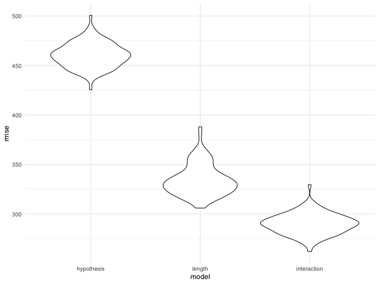

Homework 6
================
2020-12-08

# Problem 1

``` r
homicide_df = 
  read_csv("data/homicide-data.csv", na = c("", "NA", "Unknown")) %>% 
  mutate(
    city_state = str_c(city, state, sep = ", "),
    victim_age = as.numeric(victim_age),
    resolution = case_when(
      disposition == "Closed without arrest" ~ 0,
      disposition == "Open/No arrest"        ~ 0,
      disposition == "Closed by arrest"      ~ 1)
  ) %>% 
  filter(
    victim_race %in% c("White", "Black"),
    city_state != "Tulsa, AL",
    city_state != "Dallas, TX",
    city_state != "Phoenix, AZ",
    city_state != "Kansas City, MO") %>% 
  select(city_state, resolution, victim_age, victim_race, victim_sex)
```

Starting with Baltimore

``` r
baltimore_df =
  homicide_df %>% 
  filter(city_state == "Baltimore, MD")

baltimore_model = 
glm(resolution ~ victim_age + victim_race + victim_sex, 
    data = baltimore_df,
    family = binomial()) %>% 
  broom::tidy() %>% 
  mutate(
    OR = exp(estimate),
    CI_lower = exp(estimate - 1.96 * std.error),
    CI_upper = exp(estimate + 1.96 * std.error)
  ) %>% 
  select(term, OR, starts_with("CI")) %>% 
  knitr::kable(digits = 3)
```

GLM model across all cities

``` r
models_results_df = 
  homicide_df %>% 
  nest(data = -city_state) %>% 
  mutate(
    models = 
      map(.x = data, ~glm(resolution ~ victim_age + victim_race + victim_sex, data = .x, family = binomial())),
    results = map(models, broom::tidy)
  ) %>% 
  select(city_state, results) %>% 
  unnest(results) %>% 
  mutate(
    OR = exp(estimate),
    CI_lower = exp(estimate - 1.96 * std.error),
    CI_upper = exp(estimate + 1.96 * std.error)
  ) %>% 
  select(city_state, term, OR, starts_with("CI"))
```

Putting the estimates into a plot

``` r
estimate_plot = 
  models_results_df %>% 
    filter(term == "victim_raceWhite") %>% 
    mutate(city_state = fct_reorder(city_state, OR)) %>% 
    ggplot(aes(x = city_state, y = OR)) + 
    geom_point() + 
    geom_errorbar(aes(ymin = CI_lower, ymax = CI_upper)) + 
    theme(axis.text.x = element_text(angle = 90, hjust = 1)) +
    labs(
      x = "City, State")

estimate_plot
```


This plot shows cities in order of increasing odds that crimes will be
resolved if the victim is white. In Boston, White victims have over 10
times the odds of having their cases resolved than Black victims- while
there’s a large confidence interval, the odds ratio is still
significantly high. The city with the lowest odds ratio is Tampa.

## Problem 2

Reading in birthweight data

``` r
baby_df = 
  read_csv("./data/birthweight.csv") %>% 
  mutate(
    babysex = case_when(
      babysex == 1 ~ "male",
      babysex == 2 ~ "female"
    ),
    frace = case_when(
      frace == 1 ~ "White",
      frace == 2 ~ "Black",
      frace == 3 ~ "Asian",
      frace == 4 ~ "Puerto Rican",
      frace == 8 ~ "Other",
      frace == 9 ~ "Unknown"
    ),
     mrace = case_when(
      mrace == 1 ~ "White",
      mrace == 2 ~ "Black",
      mrace == 3 ~ "Asian",
      mrace == 4 ~ "Puerto Rican",
      mrace == 8 ~ "Other"
    ),
    malform = case_when(
      malform == 0 ~ "absent",
      malform == 1 ~ "present"
    ))
```

    ## Parsed with column specification:
    ## cols(
    ##   .default = col_double()
    ## )

    ## See spec(...) for full column specifications.

Creating an initial model

``` r
model_test = lm(bwt ~ gaweeks, data = baby_df)
```

Making a prediction vs residual plot

``` r
pred_resid_plot = 
  baby_df %>% 
    add_predictions(model_test) %>%
    add_residuals(model_test) %>% 
    ggplot(aes(x = pred, y = resid)) + 
    geom_point() +
    labs(
      x = "Predicted Birthweights",
      y = "Residuals")
  
pred_resid_plot
```


Cross-validation

``` r
cv_df =
  crossv_mc(baby_df, 100, test = 0.2, id = "model_id") %>% 
  mutate(
    train = map(train, as_tibble),
    test = map(test, as_tibble))

cv_df = 
  cv_df %>% 
  mutate(
    model_test_1  = map(train, ~lm(bwt ~ gaweeks, data = .x)),
    model_test_2 = map(train, ~lm(bwt ~  blength + gaweeks, data = .x)),
    model_test_3  = map(train, ~lm(bwt ~ bhead * blength * babysex, data = .x))) %>% 
  mutate(
    rmse_test_1 = map2_dbl(model_test_1, test, ~rmse(model = .x, data = .y)),
    rmse_test_2 = map2_dbl(model_test_2, test, ~rmse(model = .x, data = .y)),
    rmse_test_3 = map2_dbl(model_test_3, test, ~rmse(model = .x, data = .y)))

rmse_plot = 
  cv_df %>% 
    select(starts_with("rmse")) %>% 
    pivot_longer(
      everything(),
      names_to = "model", 
      values_to = "rmse",
      names_prefix = "rmse_") %>% 
    mutate(
      model = fct_inorder(model)) %>% 
    ggplot(aes(x = model, y = rmse)) + 
    geom_violin()

rmse_plot
```



# Problem 3

Loading in the data

``` r
weather_df = 
  rnoaa::meteo_pull_monitors(
    c("USW00094728"),
    var = c("PRCP", "TMIN", "TMAX"), 
    date_min = "2017-01-01",
    date_max = "2017-12-31") %>%
  mutate(
    name = recode(id, USW00094728 = "CentralPark_NY"),
    tmin = tmin / 10,
    tmax = tmax / 10) %>%
  select(name, id, everything())
```

    ## Registered S3 method overwritten by 'hoardr':
    ##   method           from
    ##   print.cache_info httr

    ## using cached file: /Users/adamrosenfeld/Library/Caches/R/noaa_ghcnd/USW00094728.dly

    ## date created (size, mb): 2020-10-05 21:42:02 (7.522)

    ## file min/max dates: 1869-01-01 / 2020-10-31
