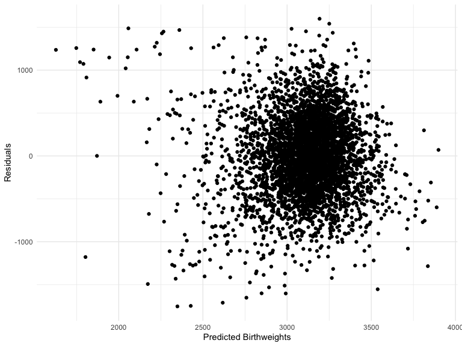

Homework 6
================
2020-12-09

# Problem 1

``` r
homicide_df = 
  read_csv("data/homicide-data.csv", na = c("", "NA", "Unknown")) %>% 
  mutate(
    city_state = str_c(city, state, sep = ", "),
    victim_age = as.numeric(victim_age),
    resolution = case_when(
      disposition == "Closed without arrest" ~ 0,
      disposition == "Open/No arrest"        ~ 0,
      disposition == "Closed by arrest"      ~ 1)
  ) %>% 
  filter(
    victim_race %in% c("White", "Black"),
    city_state != "Tulsa, AL",
    city_state != "Dallas, TX",
    city_state != "Phoenix, AZ",
    city_state != "Kansas City, MO") %>% 
  select(city_state, resolution, victim_age, victim_race, victim_sex)
```

Starting with Baltimore

``` r
baltimore_df =
  homicide_df %>% 
  filter(city_state == "Baltimore, MD")

baltimore_model = 
glm(resolution ~ victim_age + victim_race + victim_sex, 
    data = baltimore_df,
    family = binomial()) %>% 
  broom::tidy() %>% 
  mutate(
    OR = exp(estimate),
    CI_lower = exp(estimate - 1.96 * std.error),
    CI_upper = exp(estimate + 1.96 * std.error)
  ) %>% 
  select(term, OR, starts_with("CI")) %>% 
  knitr::kable(digits = 3)
```

GLM model across all cities

``` r
models_results_df = 
  homicide_df %>% 
  nest(data = -city_state) %>% 
  mutate(
    models = 
      map(.x = data, ~glm(resolution ~ victim_age + victim_race + victim_sex, data = .x, family = binomial())),
    results = map(models, broom::tidy)
  ) %>% 
  select(city_state, results) %>% 
  unnest(results) %>% 
  mutate(
    OR = exp(estimate),
    CI_lower = exp(estimate - 1.96 * std.error),
    CI_upper = exp(estimate + 1.96 * std.error)
  ) %>% 
  select(city_state, term, OR, starts_with("CI"))
```

Putting the estimates into a plot

``` r
estimate_plot = 
  models_results_df %>% 
    filter(term == "victim_raceWhite") %>% 
    mutate(city_state = fct_reorder(city_state, OR)) %>% 
    ggplot(aes(x = city_state, y = OR)) + 
    geom_point() + 
    geom_errorbar(aes(ymin = CI_lower, ymax = CI_upper)) + 
    theme(axis.text.x = element_text(angle = 90, hjust = 1)) +
    labs(
      x = "City, State")

estimate_plot
```


This plot shows cities in order of increasing odds that crimes will be
resolved if the victim is white. In Boston, White victims have over 10
times the odds of having their cases resolved than Black victims- while
there’s a large confidence interval, the odds ratio is still
significantly high. The city with the lowest odds ratio is Tampa.

## Problem 2

Reading in birthweight data, tidying

``` r
baby_df = 
  read_csv("./data/birthweight.csv") %>% 
  mutate(
    babysex = case_when(
      babysex == 1 ~ "male",
      babysex == 2 ~ "female"
    ),
    frace = case_when(
      frace == 1 ~ "White",
      frace == 2 ~ "Black",
      frace == 3 ~ "Asian",
      frace == 4 ~ "Puerto Rican",
      frace == 8 ~ "Other",
      frace == 9 ~ "Unknown"
    ),
     mrace = case_when(
      mrace == 1 ~ "White",
      mrace == 2 ~ "Black",
      mrace == 3 ~ "Asian",
      mrace == 4 ~ "Puerto Rican",
      mrace == 8 ~ "Other"
    ),
    malform = case_when(
      malform == 0 ~ "absent",
      malform == 1 ~ "present"
    ))
```

    ## Parsed with column specification:
    ## cols(
    ##   .default = col_double()
    ## )

    ## See spec(...) for full column specifications.

Creating an initial model

``` r
hypothesis_mod = lm(bwt ~ gaweeks + ppbmi + smoken + momage, data = baby_df)
```

This model was chosen based on a hypothesis that mother’s health would
have a significant effect on birthweight. Factors included were number
of cigarettes smoked, mother’s BMI pre-pregnancy, and mother’s age at
delivery.

Making a prediction vs residual plot

``` r
pred_resid_plot = 
  baby_df %>% 
    add_predictions(hypothesis_mod) %>%
    add_residuals(hypothesis_mod) %>% 
    ggplot(aes(x = pred, y = resid)) + 
    geom_point() +
    labs(
      x = "Predicted Birthweights",
      y = "Residuals")
  
pred_resid_plot
```



Cross-validation

``` r
cv_df =
  crossv_mc(baby_df, 100, test = 0.2, id = "model_id") %>% 
  mutate(
    train = map(train, as_tibble),
    test = map(test, as_tibble))

cv_df = 
  cv_df %>% 
  mutate(
    hypothesis_mod  = map(train, ~lm(bwt ~ gaweeks + ppbmi + smoken + momage, data = .x)),
    length_mod = map(train, ~lm(bwt ~  blength + gaweeks, data = .x)),
    interaction_mod  = map(train, ~lm(bwt ~ bhead * blength * babysex, data = .x))) %>% 
  mutate(
    rmse_hypothesis = map2_dbl(hypothesis_mod, test, ~rmse(model = .x, data = .y)),
    rmse_length = map2_dbl(length_mod, test, ~rmse(model = .x, data = .y)),
    rmse_interaction = map2_dbl(interaction_mod, test, ~rmse(model = .x, data = .y)))

rmse_plot = 
  cv_df %>% 
    select(starts_with("rmse")) %>% 
    pivot_longer(
      everything(),
      names_to = "model", 
      values_to = "rmse",
      names_prefix = "rmse_") %>% 
    mutate(
      model = fct_inorder(model)) %>% 
    ggplot(aes(x = model, y = rmse)) + 
    geom_violin()

rmse_plot
```


Comparing in terms of cross-validated prediction error, it appears that
the hypothesized model does not perform as well as the length or
interaction models (most rmse values are significantly higher than the
other two models).

# Problem 3

Loading in the data

``` r
weather_df = 
  rnoaa::meteo_pull_monitors(
    c("USW00094728"),
    var = c("PRCP", "TMIN", "TMAX"), 
    date_min = "2017-01-01",
    date_max = "2017-12-31") %>%
  mutate(
    name = recode(id, USW00094728 = "CentralPark_NY"),
    tmin = tmin / 10,
    tmax = tmax / 10) %>%
  select(name, id, everything())
```

    ## Registered S3 method overwritten by 'hoardr':
    ##   method           from
    ##   print.cache_info httr

    ## using cached file: /Users/adamrosenfeld/Library/Caches/R/noaa_ghcnd/USW00094728.dly

    ## date created (size, mb): 2020-10-05 21:42:02 (7.522)

    ## file min/max dates: 1869-01-01 / 2020-10-31

Creating the log of betas plot

``` r
bootstrap_beta_plot = 
  weather_df %>% 
    bootstrap(n = 5000, id = "id") %>% 
   mutate(
    models = map(strap, ~ lm(tmax ~ tmin, data = .x)),
    results = map(models, broom::tidy)) %>% 
  select(id, results) %>% 
  unnest(results) %>%
  select(id, term, estimate) %>% 
  group_by(id) %>% 
  pivot_wider(
    names_from = term,
    values_from = estimate
  ) %>% 
  janitor::clean_names() %>% 
  mutate(
    beta_log = log(intercept * tmin)
  ) %>% 
  ggplot(aes(x = beta_log)) + 
  geom_density() +
   labs(
      x = "log(B0*B1)")

bootstrap_beta_plot
```


This plot shows that most values are concentrated between 2 and 2.025.

Getting the R squared plot

``` r
bootstrap_r_plot = 
  weather_df %>% 
    bootstrap(n = 5000, id = "id") %>% 
   mutate(
    models = map(strap, ~ lm(tmax ~ tmin, data = .x)),
    results = map(models, broom::glance)) %>% 
  select(id, results) %>% 
  unnest(results) %>% 
  ggplot(aes(x = r.squared)) + 
  geom_density() +
   labs(
      x = "r squared values")

bootstrap_r_plot
```


Most r-squared values for this bootstrap are concentrated between 0.91
and 0.92.

Confidence Intervals for r-squared

``` r
bootstrap_r_intervals = 
  weather_df %>% 
    bootstrap(n = 5000, id = "id") %>% 
   mutate(
    models = map(strap, ~ lm(tmax ~ tmin, data = .x)),
    results = map(models, broom::glance)) %>% 
  select(id, results) %>% 
  unnest(results) %>% 
  summarize(
    r_ci_lower = quantile(r.squared, 0.025), 
    r_ci_upper = quantile(r.squared, 0.975)) %>% 
  knitr::kable(digits = 3)

bootstrap_r_intervals
```

| r\_ci\_lower | r\_ci\_upper |
| -----------: | -----------: |
|        0.893 |        0.927 |

Confidence Intervals for log of intercept multiplied by beta 1

``` r
bootstrap_beta_intervals = 
  weather_df %>% 
    bootstrap(n = 5000, id = "id") %>% 
   mutate(
    models = map(strap, ~ lm(tmax ~ tmin, data = .x)),
    results = map(models, broom::tidy)) %>% 
  select(id, results) %>% 
  unnest(results) %>%
  select(id, term, estimate) %>% 
  group_by(id) %>% 
  pivot_wider(
    names_from = term,
    values_from = estimate
  ) %>% 
  janitor::clean_names() %>% 
  mutate(
    beta_log = log(intercept * tmin)
  ) %>% 
  ungroup(id) %>% 
  summarize(
    bl_ci_lower = quantile(beta_log, 0.025), 
    bl_ci_upper = quantile(beta_log, 0.975)) %>% 
  knitr::kable(digits = 3)

bootstrap_beta_intervals
```

| bl\_ci\_lower | bl\_ci\_upper |
| ------------: | ------------: |
|         1.965 |         2.059 |
